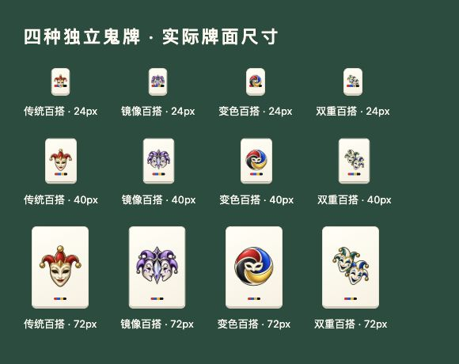

# 拉密四类鬼牌独立资源 v2

2026-10-06。使用内置 imagegen 分别生成四张完整原创图案；透明 PNG，发布图为 256 × 256。旧 `joker-mark.png` 保留兼容，但新页面不再使用 CSS 叠图代替特殊类型。

- 传统：红金三角冠与单面具；[图片](../../app/assets/joker-normal-v2.png)。
- 镜像：紫银双向侧面具与中央镜轴；[图片](../../app/assets/joker-mirror-v2.png)。
- 变色：红、蓝、黄、黑四色旋环与中心面具；[图片](../../app/assets/joker-color-change-v2.png)。
- 双重：蓝绿双面具错位叠放；[图片](../../app/assets/joker-double-v2.png)。

图案轮廓和文字辅助同时表达类型，颜色不是唯一线索。规则、牌 ID 和存档保持原版本；资源图不能决定牌的效果。显示失败保留中文类型，未知类型显式显示未知，不借普通鬼牌冒充。

公开资源由本项目生成，不取用参考商业游戏的美术。源图保留在维护者的生成目录，仓库发布图只做尺寸与无损编码优化，保留 alpha；本轮未向生成工具传入参考图，未复制第三方品牌。四张图的生成没有调用另购 API 或建立云资源。

[尺寸、校验和与类型清单](jokers-v2.json)。



## 生成提示词

使用内置 imagegen，四次独立生成，`transparent_background=true`，未传入外部参考图。

### normal

```text
Use case: stylized-concept. Asset type: one original small Rummikub joker tile illustration for a polished private board-game app. Create one complete independently drawn icon, not a sprite sheet and not a card mockup. Cohesive family style: clean premium enamel illustration, broad confident near-black outlines, ivory mask accents, simple restrained bevel highlights, crisp silhouette that reads at 24 pixels. Center one emblem occupying roughly 80 percent of square canvas, consistent generous padding. Real transparent alpha background. No tile rectangle, no text, no numbers, no letters, no watermark, no scenery, no emoji, no tiny decorative details. Each variant must be visually distinct by shape as well as color. Subject: the TRADITIONAL WILD joker. A single forward-facing ivory theatrical half-mask wearing a simple three-point jester crown. Bold ruby red and warm gold crown, three large round tips, charcoal eye openings. One compact iconic face, red/gold dominant palette. Symmetric, upright, friendly and elegant rather than clownish.
```

### mirror

```text
Use case: stylized-concept. Asset type: one original small Rummikub joker tile illustration for a polished private board-game app. Create one complete independently drawn icon, not a sprite sheet and not a card mockup. Cohesive family style: clean premium enamel illustration, broad confident near-black outlines, ivory mask accents, simple restrained bevel highlights, crisp silhouette that reads at 24 pixels. Center one emblem occupying roughly 80 percent of square canvas, consistent generous padding. Real transparent alpha background. No tile rectangle, no text, no numbers, no letters, no watermark, no scenery, no emoji, no tiny decorative details. Each variant must be visually distinct by shape as well as color. Subject: the MIRROR joker. One complete emblem of TWO ivory theatrical half-mask profiles facing each other symmetrically across a tall central faceted mirror diamond. Joined simple purple and silver jester crown above the two profiles, lavender and deep violet accents, clearly a double facing mirrored silhouette with a central vertical axis. It must read as reflection at a glance; do not use a single normal face.
```

### color-change

```text
Use case: stylized-concept. Asset type: one original small Rummikub joker tile illustration for a polished private board-game app. Create one complete independently drawn icon, not a sprite sheet and not a card mockup. Cohesive family style: clean premium enamel illustration, broad confident near-black outlines, ivory mask accents, simple restrained bevel highlights, crisp silhouette that reads at 24 pixels. Center one emblem occupying roughly 80 percent of square canvas, consistent generous padding. Real transparent alpha background. No tile rectangle, no text, no numbers, no letters, no watermark, no scenery, no emoji, no tiny decorative details. Each variant must be visually distinct by shape as well as color. Subject: the COLOR CHANGING joker. One compact ivory theatrical half-mask nestled inside a large bold FOUR-SEGMENT rotating ribbon crown, an unmistakable circular spiral silhouette. Four broad segments in vivid ruby RED, cobalt BLUE, sunny GOLD and charcoal BLACK, each large and separated by ivory seams. Small simple ivory eye mask in center; the large circular color-wheel silhouette is the main motif, no thin spokes.
```

### double

```text
Use case: stylized-concept. Asset type: one original small Rummikub joker tile illustration for a polished private board-game app. Create one complete independently drawn icon, not a sprite sheet and not a card mockup. Cohesive family style: clean premium enamel illustration, broad confident near-black outlines, ivory mask accents, simple restrained bevel highlights, crisp silhouette that reads at 24 pixels. Center one emblem occupying roughly 80 percent of square canvas, consistent generous padding. Real transparent alpha background. No tile rectangle, no text, no numbers, no letters, no watermark, no scenery, no emoji, no tiny decorative details. Each variant must be visually distinct by shape as well as color. Subject: the DOUBLE joker. One complete independently painted emblem of TWO staggered ivory theatrical half-masks with simple two-point jester crowns, one above-left and one below-right, both visible and separated by clear ivory/black outlines. Bold teal and blue enamel accents with gold tips. Clearly two overlapping faces in a diagonal stepped silhouette, no tile rectangles, not symmetric mirror profiles and no circular color wheel.
```

## 验收

检查实际手牌、公共桌面、单牌/整组拖影、他人公开预览和放大查看；独立入口及 Agora `/game/` 挂载入口分别验证四张图片的路径、类型与实际 PNG 内容。小牌面要能区分单脸、双向镜像、旋环、双脸叠放。手机模拟视口只证明呈现，实际设备触摸和听感单独验收。正式发布证据在项目唯一运行清单及本批运维记录登记。
